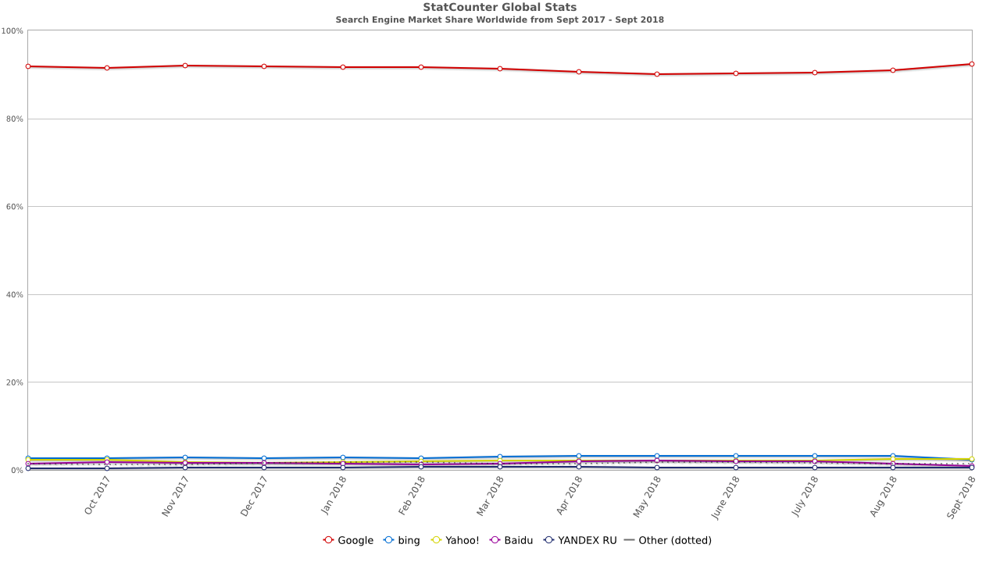

### Search Engine Optimization
Nitin Nizhawan
---

### About Myself

- Software Developer, with around 10 years of experience
- Currently working with Adobe Systems Pvt. Ltd.
[Product I work on](https://www.youtube.com/watch?v=X8SCBUgv2TE "Product I work on")

---

### Why Google?

---

### How do search engines work?

  
 

---
### How do I get more traffic?
 - Use Email Marketing
 - Social Media 
 - Get Listed 
 - Rank Higher in search results 
---
### What search engines want?

- Quick answers / Accuracy
- Authenticity / Transparency 

---

### How do I create great content?
 
- Find whats relavant to your business
- Wrong keywords can backfire
- Understand your users (become your users)
- Brainstorm within your team
- Talk to outside people
- Look at competition website

---
### Keyword Research

 - Tools
   - Google search
   - keywordtool.io
   - answerthepublic.com
   - soovle.com
   - www.seobook.com
   - Google Keywords planner
   - Google Trends
 - Be relevant
 - Don't be greedy (max 3-4 phrases per page)
 - Be precise

 
Note:
  firecrackers, trends query
---

 ## Long Tail

 

---

### How will search engines know, your website exists?

  - From other websites on the web
  - By letting search engines know about your website?
    - Google Search Console
    - XML Sitemap
    - Robots.txt
      - pages meant for computers
      - pages requiring authentication

Note: 
   - https://moz.com/robots.txt
   - https://moz.com/sitemaps/1/sitemap.xml

---
### You do not like how your pages look in search results.

 - title
 - description
 - google structured data
 - opengraph

Note: 
  search blockchain medium for title and description
  https://medium.com/tag/blockchain 
  http://ogp.me/ for opengraph
https://search.google.com/structured-data/testing-tool/u/0/
https://developers.google.com/search/docs/guides/search-gallery

---

 -  Great content
 -  Indexable website
 -  Great looking search result
 -  Can we do better?

---
### Page Performance
 - Impact
     - Lower Search ranking
     - Fewer page indexes
 - Improving Performance
     - Network Calls
     - Critical Rendering Path
     - Caching
 Note:
   zomato audit

---

### Semantic Tags
  - header
  - section
  - nav
  - article
  - aside
  - strong
  - emphasis
  - abbr
  - footer
  - h1,h2,h3

Note:

https://medium.com/@ecometh/how-to-use-ecometh-token-94ca8a66d4f3  
https://medium.com/netflix-techblog/pseudo-localization-netflix-12fff76fbcbe
 
---

### Other optimizations

 - Urls
   - Naming
   - canonicalisation
   - mobile/desktop
 - Pagination
 - HTTP Status Codes
 - Image names, alt, title 

Note:

https://www.zomato.com/ncr for redirects
https://medium.com/tag/blockchain  for canonicalization
https://www.ampproject.org/docs/fundamentals/discovery

---

### Analyse

- Moz
- Screaming Frog

---

### Thank You

